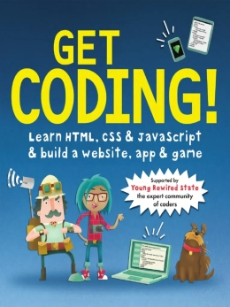

  <b>A course in my <a href="https://github.com/abeerration/CS-Self-Education">CS Self Education</a> series</b>
  <h1>Coding Tutorial – Module 1</h1>
  

  
    <a href="https://www.vecteezy.com/vector-art/4865921-programmer-people-concept-use-laptop-and-programming-code-program-icon-spreading-with-modern-flat-style">Vector</a> by Vecteezy
  

---

## Prerequisites

None

## Description & Goals

This introductory course offers a quick first dive into coding using HTML/CSS/JavaScript web development and Python.

The course comprises of two modules.

- [**Module 1**](https://github.com/abeerration/Coding-Tutorial-Module-1) teaches hands-on web development basics.
- [**Module 2**](https://github.com/abeerration/Coding-Tutorial-Module-2) comprises of Python and more web development, backed with a bit more computer theory.

---

## Materials for Module 1

| # | Cover | Title |
| ----------- | ----------- | ----------- |
| **1.** |  | <h4><i>David Whitney / Young Rewired State</i></h4><h2>Get Coding! Learn HTML, CSS & JavaScript</h2><h4>Walker Books</h4>
2016

<i>Book</i>
 |

---

## Course Work for Module 1

| # | Activity | Date / Duration | Links |
| ----------- | ----------- | ----------- | ----------- |
| **1.** | **Mission 1** – Build a web page | 22 Nov 2023 | [code](https://github.com/abeerration/Coding-Tutorial-Module-1/tree/main/activities/1) / [demo](https://abeerration.github.io/Coding-Tutorial-Module-1/activities/1/) |
| **2.** | **Mission 2** – Create a password | 25 Nov 2023 | [code](https://github.com/abeerration/Coding-Tutorial-Module-1/tree/main/activities/2) / [demo](https://abeerration.github.io/Coding-Tutorial-Module-1/activities/2/) |
| **3.** | **Mission 3** – Build an app | - | [code]() / [demo]() |
| **4.** | **Mission 4** – Plan a route | - | [code]() / [demo]() |
| **5.** | **Mission 5** – Make a game | - | [code]() / [demo]() |
| **6.** | **Mission 6** – Finished website | - | [code]() / [demo]() |
| **7.** | **Project** – [YouTubeVideoThumbnails](https://github.com/abeerration/YouTubeVideoThumbnails) | - | [GitHub repo](https://github.com/abeerration/YouTubeVideoThumbnails) |
